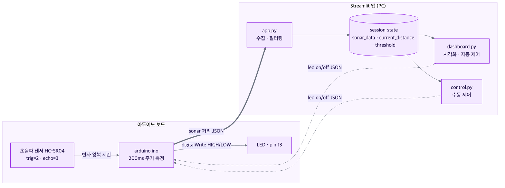
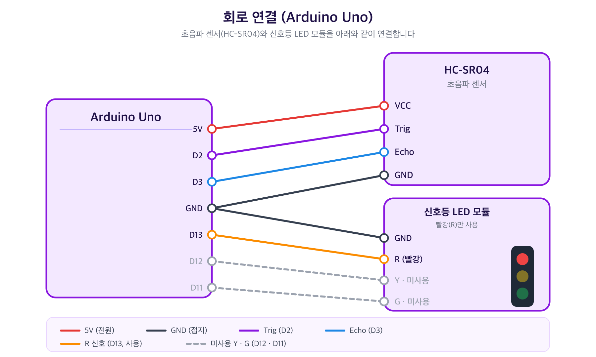

# 🚦 거리 기반 자동 제어 시스템


> 초음파 센서로 사람과의 거리를 감지해 **LED를 자동으로 켜고 끄는** Arduino + Streamlit 풀스택 IoT 프로젝트입니다.

어두운 복도나 주차장처럼 사람이 가까이 왔을 때 자동으로 불이 켜지면 안전하고 편리합니다.
이 프로젝트는 **초음파 센서(HC-SR04)** 로 거리를 측정하고, 설정한 임계값보다 가까워지면 **LED를 자동으로 점등**합니다.
측정값은 **Streamlit 웹 대시보드**에서 실시간으로 시각화되고, 임계값 조정·자동/수동 제어도 화면에서 할 수 있습니다.

---

## ✨ 주요 기능

- **실시간 거리 측정 & 시각화** — 0.3초마다 갱신되는 거리 그래프(원본 + 20점 이동평균)
- **거리 기반 자동 제어** — 거리가 임계값(기본 15cm)보다 가까우면 LED ON, 멀어지면 OFF
- **수동 제어** — 버튼으로 LED를 직접 On/Off
- **페일세이프** — 2초 이상 센서 신호가 없으면 안전을 위해 LED 자동 OFF
- **현황 지표** — 현재 / 최대 / 최소 / 평균 거리 카드와 원본 데이터 표

---

## 🧩 시스템 구성

전체 시스템은 **아두이노 보드**(센서·LED·펌웨어)와 **Streamlit 앱**(PC)이 USB 시리얼로 JSON 메시지를 주고받으며 동작합니다.
아두이노는 거리를 측정해 위로 보내고, Streamlit은 거리를 보고 LED 명령을 아래로 내려보냅니다.



> 아두이노 ↔ Streamlit 연결은 USB 시리얼(115200 baud)이며, 모든 메시지는 JSON 한 줄로 오갑니다.

---

## 🔌 하드웨어 & 회로 연결

**사용 부품**

- 초음파 센서 HC-SR04 (거리 측정)
- 신호등 LED 모듈 (4핀: GND·R·Y·G, 저항 내장형)
- 아두이노 우노 (Arduino Uno)

**핀 연결** — 신호등 모듈은 GND를 아두이노 GND에 잇고, 각 색 핀을 디지털 핀에 연결합니다.

| 부품 핀 | 아두이노 핀 |
| --- | --- |
| HC-SR04 VCC | 5V |
| HC-SR04 Trig | D2 |
| HC-SR04 Echo | D3 |
| HC-SR04 GND | GND |
| 신호등 GND | GND |
| 신호등 R (빨강) | D13 |
| 신호등 Y (노랑) | D12 *(미사용)* |
| 신호등 G (초록) | D11 *(미사용)* |



> 💡 자동 제어에는 **빨강(R, 13번)** 만 사용합니다. 노랑(Y)·초록(G)은 배선만 해 둔 상태로, 향후 단계별 표시(예: 접근 중/감지) 확장에 쓸 수 있습니다.

---

## 📨 메시지 형식 (JSON)

아두이노와 앱은 한 줄짜리 JSON 메시지로 통신합니다.

**아두이노 → 앱** (거리 측정값, 200ms 주기)

```json
{ "type": "sonar", "distance": 35 }
```

**앱 → 아두이노** (LED 제어 명령)

```json
{ "type": "led", "status": "on" }
```

---

## 📁 파일 구조

```
.
├── app.py               # 시리얼 연결·데이터 수집·페이지 내비게이션 (앱 진입점)
├── dashboard.py         # 실시간 거리 시각화 + 거리 기반 자동 제어
├── control.py           # LED 수동 On/Off 제어
├── arduino/
│   └── arduino.ino      # 초음파 거리 측정 & LED 제어 펌웨어
├── docs/                # 설계 문서·다이어그램·보고서
├── requirements.txt
└── README.md
```

- **`app.py`** — `get_ser()`로 시리얼 포트에 연결하고, `fetch_data()`로 `sonar` 메시지를 수집합니다(3~200cm만 저장, 최대 200개). 0.3초마다 도는 사이드바 fragment에서 데이터를 모으고, `st.navigation`으로 대시보드/수동 제어 페이지를 전환합니다.
- **`dashboard.py`** — 0.3초마다 거리 그래프(원본 + `window=20` 이동평균, 최근 60개)와 지표 카드를 갱신합니다. 임계값 입력칸과 `자동 제어` 토글을 제공하고, `control_traffic()`이 거리와 임계값을 비교해 LED 명령을 보냅니다. 2초 이상 신호가 없으면 자동으로 끕니다.
- **`control.py`** — On/Off 버튼으로 `led` 명령을 직접 전송하고, 마지막으로 보낸 JSON을 화면에 표시합니다.
- **`arduino/arduino.ino`** — 200ms마다 거리를 측정해 전송하고(`거리 = 시간 × 0.034 ÷ 2`), 들어온 `led` 명령에 따라 13번 핀을 HIGH/LOW로 제어합니다.

---

## 🛠️ 환경 설정 및 설치 (Setup)

본 프로젝트는 하드웨어(Arduino)와 소프트웨어(Python)가 만나는 과정입니다. 아래 순서대로 설정을 완료해 주세요.

### 1. 필수 소프트웨어 설치

1. [Arduino IDE](https://www.arduino.cc/en/software/): 아두이노 보드에 제어 코드를 작성·업로드하는 도구입니다.
2. [아두이노 드라이버 (USB Driver)](https://www.wch-ic.com/downloads/CH341SER_EXE.html): 컴퓨터가 아두이노 보드를 인식하고 통신하게 해주는 도구입니다.
   - 💡 보드를 연결했는데 포트가 뜨지 않으면 이 드라이버를 설치하세요.
3. [Python (3.12 이상)](https://www.python.org/downloads/): 데이터 처리와 대시보드를 담당합니다.
   - ⚠️ 설치 시 **[Add Python to PATH]** 체크박스를 반드시 선택하세요!
4. [VS Code](https://code.visualstudio.com/): 코드를 작성·실행할 메인 에디터입니다.

### 2. 파이썬 라이브러리 설치

VS Code 터미널을 열고 아래 명령어를 입력하세요. (프로젝트 폴더가 열려 있어야 합니다 — 왼쪽 파일 목록에 `requirements.txt`가 보여야 해요!)

```bash
pip install -r requirements.txt
```

주요 라이브러리:

- `streamlit` — 파이썬만으로 실시간 데이터 대시보드를 만듭니다.
- `pyserial` — 아두이노와 파이썬 사이의 시리얼 통신 통로를 엽니다.
- `pandas` — 수집한 거리 데이터를 표·그래프 형태로 정리합니다.
- `watchdog` — 파일 변화를 감시해 대시보드에 즉시 반영합니다.

### 3. 아두이노 라이브러리

Arduino IDE의 라이브러리 매니저에서 아래를 설치합니다.

- [ArduinoJson 7](https://arduinojson.org/) — JSON 메시지 송수신에 사용합니다.

---

## ⚡ 실행 방법 (How to Run)

### 1. 아두이노 연결 및 업로드

- 아두이노 보드를 컴퓨터 USB 포트에 연결합니다.
- Arduino IDE에서 `arduino/arduino.ino`를 보드에 **업로드(Upload)** 합니다.

### 2. 대시보드 실행

VS Code 터미널에서:

```bash
streamlit run app.py
```

### 3. 시리얼 포트 연결

- 사이드바의 **시리얼 포트** 칸에 보드의 포트를 입력합니다.
  - Windows: `COM3` (장치 관리자에서 확인)
  - macOS / Linux: `/dev/cu.usbserial-XXXX` 또는 `/dev/ttyUSB0` 형태
- `연결 성공!` 메시지가 뜨면 사이드바에 현재 거리가 표시됩니다.

### 4. 자동 제어 사용

- **대시보드** 페이지에서 `임계값 (cm)`을 설정하고 **`자동 제어`** 토글을 켭니다.
- **수동 제어** 페이지에서는 On/Off 버튼으로 LED를 직접 제어할 수 있습니다.

---

## 📚 문서

- 📐 **기능 설계 문서** — [거리 기반 자동 제어 시스템](<docs/issue-2-거리-기반-자동-제어-시스템.md>)
- 🖼️ **다이어그램** — [docs/diagrams/](docs/diagrams/) (시스템 구성·회로·센서 타이밍·데이터 파이프라인·제어 흐름·앱 구조)
- 📝 **결과보고서** — [2026 과학기술진로프로그램(1차) 결과보고서](<docs/2026 과학기술진로프로그램(1차) 결과보고서.md>)
- 🎞️ **포트폴리오** — [거리기반자동제어시스템_포트폴리오.pptx](docs/거리기반자동제어시스템_포트폴리오.pptx)
