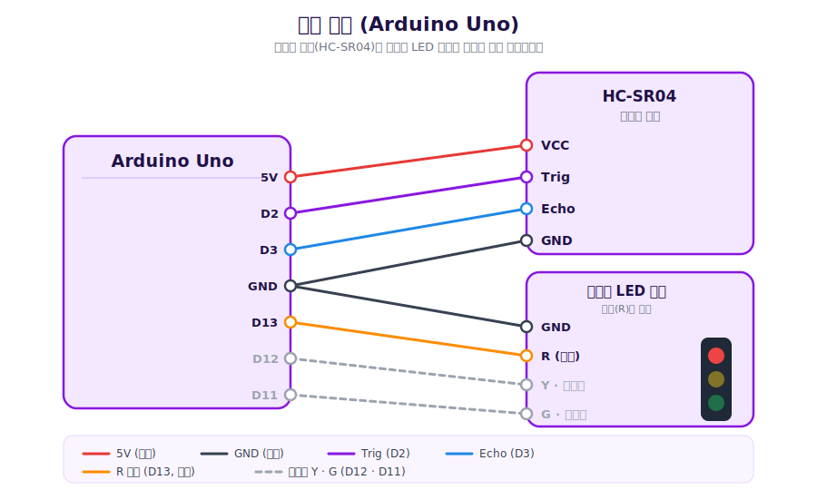
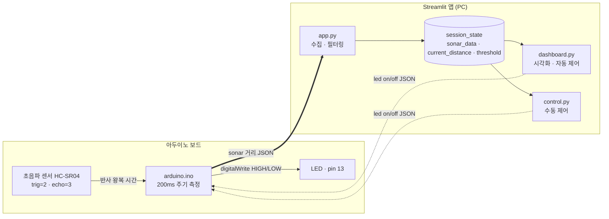
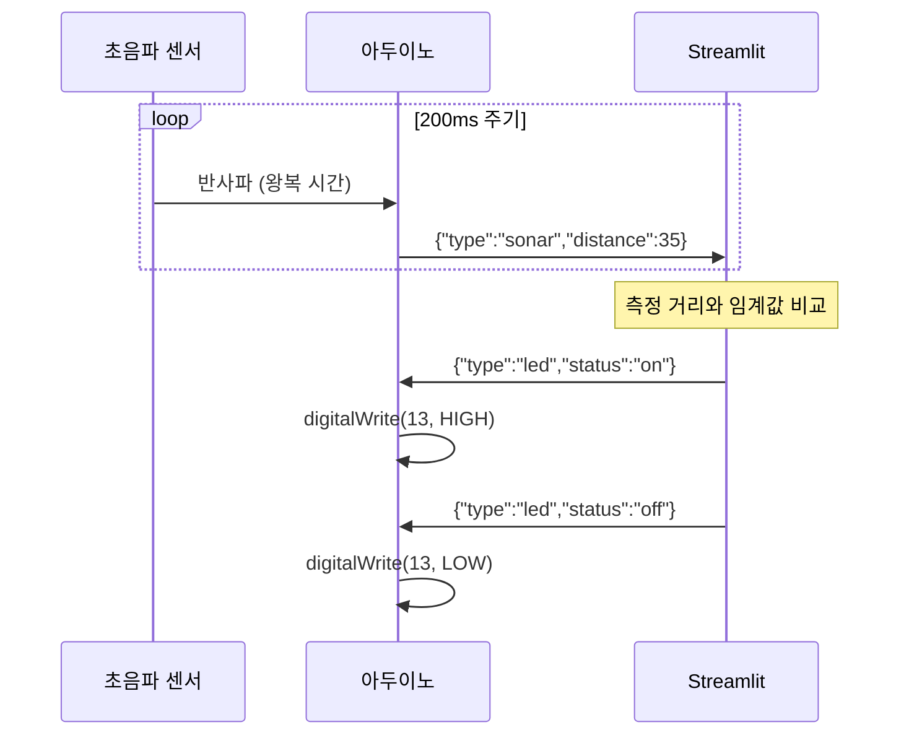
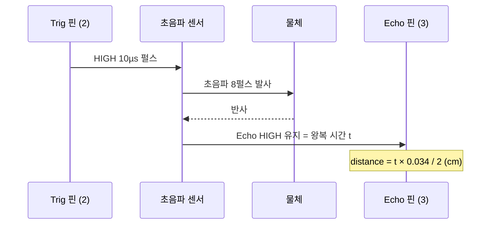
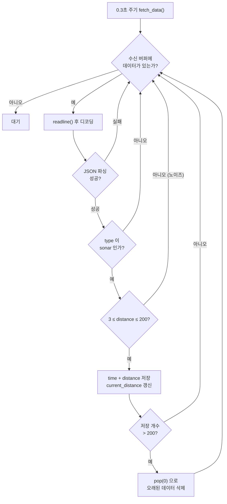
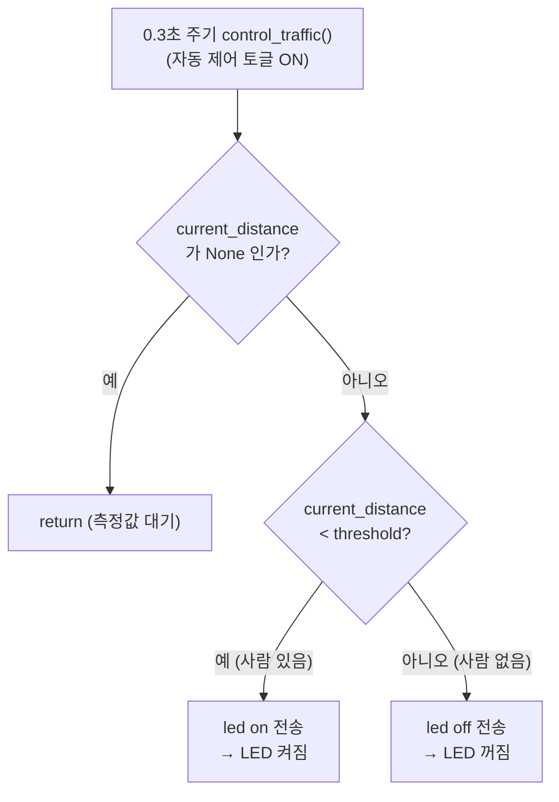
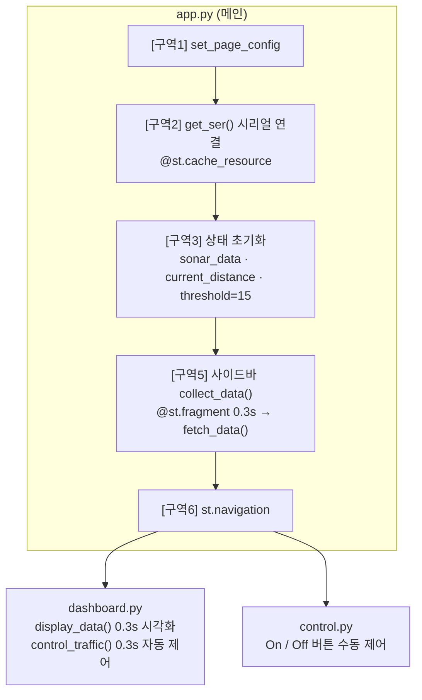

# 거리 기반 자동 제어 시스템

> GitHub Issue [#2](https://github.com/JJGIRL-sHS/8-nayoon123-2/issues/2)
> 상태: **OPEN** · 작성자: safecorners · 생성: 2026-04-14 · 수정: 2026-04-19

## 동기
어두운 곳이나 주차장, 복도 등에서 사람이 가까이 왔을 때 자동으로 불이 켜지면 안전하고 편리하다. 하지만 대부분은 직접 스위치를 눌러야 해서 불편함이 있다. 이러한 불편을 해결하기 위해 거리 변화를 감지하여 자동으로 작동하는 시스템을 만들어보고자 했다.

## 해결 방안
초음파 센서를 이용해 사람과의 거리를 측정하고, 일정 거리 이하로 가까워지면 LED를 켜도록 한다. 반대로 거리가 멀어지면 LED를 끄도록 하여 거리 변화에 따라 자동으로 반응하는 시스템을 구현한다.

## 사용부품
- 초음파 센서 (HC-SR04)
- 신호등 LED 모듈 (4핀: GND·R·Y·G, 저항 내장 / 빨강 R만 사용, 노랑·초록 미사용)

---

## 회로 연결

Arduino Uno 기준으로 부품을 아래 표대로 연결합니다. 신호등 모듈은 GND를 아두이노 GND에 잇고, 각 색 핀을 디지털 핀에 연결합니다. 자동 제어에는 **빨강(R, D13)** 만 사용합니다.

| 부품 핀 | 아두이노 핀 |
| --- | --- |
| HC-SR04 VCC | 5V |
| HC-SR04 Trig | D2 |
| HC-SR04 Echo | D3 |
| HC-SR04 GND | GND |
| 신호등 GND | GND |
| 신호등 R (빨강) | D13 |
| 신호등 Y (노랑) | D12 (미사용) |
| 신호등 G (초록) | D11 (미사용) |



> 💡 자동 제어에는 빨강(R, 13번)만 사용합니다. 노랑·초록은 배선만 해 둔 상태로 향후 단계별 표시 확장에 쓸 수 있습니다. (13번은 보드 내장 LED와도 연결되어 있어 빨강과 함께 깜빡입니다.)

---

## 시스템 구성

전체 시스템은 **아두이노 보드**(센서·LED·펌웨어)와 **Streamlit 앱**(PC)이 USB 시리얼로 JSON 메시지를 주고받으며 동작합니다. 아두이노는 거리를 측정해 위로 보내고, Streamlit은 거리를 보고 LED 명령을 아래로 내려보냅니다.



> 아두이노 ↔ Streamlit 연결은 USB 시리얼(115200 baud)이며, 모든 메시지는 JSON 한 줄로 오갑니다.

---

## 1. 메시지 형식 정하기

시스템 안에서 어떤 메시지를 주고 받을지 부터 생각해야합니다.

아두이노가 초음파 센서로 거리를 측정하고 보내는 메시지 형식입니다.

```json
{
    "type": "sonar",
    "distance": 35
}
```

스트림릿에서 아두이노에게 명령을 내릴 때 사용하는 메시지 형식입니다.

```json
{
  "type": "led",
  "status": "on"
}
```

```json
{
  "type": "led",
  "status": "off"
}
```

두 종류의 메시지가 시간 순서로 어떻게 오가는지 정리하면 다음과 같습니다.



---

## 2. 초음파 센서 아두이노 코드

### 초음파 센서 작동 원리


1. 신호 발생(Trig): 센서의 Trig(트리거) 핀에 짧은 전기 신호를 주면, 센서가 사람이 들을 수 없는 높은 주파수의 소리(초음파)를 8번 연속해서 발사합니다.
2. 반사 및 수신 (Echo): 발사된 초음파가 물체에 맞고 튕겨 돌아오면, 센서의 Echo(에코) 핀이 이를 감지합니다.
3. 시간 측정(Duration): 초음파를 보낸 시점부터 다시 돌아온 시점까지 걸린 시간($t$)을 계산합니다.
4. 거리 환산 (Distance): 소리의 속도(약 $340m/s$)를 시간($t$)에 곱한 뒤, 왕복 거리이므로 2로 나누어 최종 거리를 구합니다.

Trig 신호부터 거리 계산까지의 신호 흐름을 핀 단위로 나타내면 다음과 같습니다.



### 선언 및 초기화

**sonar.ino**

```cpp
#include <ArduinoJson.h>

const int trigPin = 2;
const int echoPin = 3;

unsigned long lastSentTime = 0;
const int interval = 300;
```

- 2번 핀을 트리거핀, 3번 핀을 에코핀으로 사용합니다.
- 300ms를 주기로 거리를 측정하고 전송합니다.

```cpp
void setup() {
  Serial.begin(115200);
  Serial.setTimeout(50);

  pinMode(trigPin, OUTPUT);
  pinMode(echoPin, INPUT);

}
```

- 트리거핀을 출력 모드로, 에코핀을 입력모드로 사용합니다.

### 거리 측정 함수

```cpp
int calculateDistance() {
  digitalWrite(trigPin, LOW);
  delayMicroseconds(2);
  digitalWrite(trigPin, HIGH);
  delayMicroseconds(10);
  digitalWrite(trigPin, LOW);

  long duration = pulseIn(echoPin, HIGH);
  int distance = duration * 0.034 / 2;

  return distance;
}
```

1. `digitalWrite(trigPin, HIGH)`: 초음파를 쏴! 라고 명령을 내리는 코드입니다.
2. `pulseIn()` 함수를 이용해 초음파가 발사된 후 물체에 맞고 돌아올 때까지 걸린 '왕복 시간'을 마이크로초($\mu s$) 단위로 측정하는 코드입니다.
3. 측정된 시간($\mu s$)에 소리의 속도($0.034cm/\mu s$)를 곱해 이동 거리를 구한 뒤, 왕복 값인 점을 고려해 2로 나누어 최종 거리(cm)를 계산하는 코드입니다.

### 측정 및 데이터 전송

주기적으로 거리를 측정하고 데이터를 전송합니다.

```cpp
void loop() {

  unsigned long currentTime = millis();
  if (currentTime - lastSentTime >= interval) {

    int distance = calculateDistance();

    JsonDocument doc;

    doc["type"] = "sonar";
    doc["distance"] = distance;

    serializeJson(doc, Serial);
    Serial.println();

    lastSentTime = currentTime;
  }
}
```

### 전송 확인

코드를 업로드 한 뒤 `Arduino IDE`에서 `시리얼 모니터`를 열어 데이터가 정상적으로 전송되고 있는지 확인합니다.


---

## 3. 스트림릿 메시지 수신

### 시리얼 통신 대기 시간 설정

데이터가 없거나 전송 중일 때 기다리는 시간(timeout)을 설정합니다.
데이터가 300ms 단위로 전송되고 있으므로 0.3초 보다는 적어야 합니다.
대기 시간을 0.1초 설정하겠습니다.

**app.py**

```python
@st.cache_resource
def get_ser(port):
    try:
        return serial.Serial(port, 115200, timeout=1)
    except:
        return None
```

### 상태 초기화

```python
# =========================================================
# [구역 3] 상태 초기화
# =========================================================

if "sonar_data" not in st.session_state:
    st.session_state.sonar_data = []

if "current_distance" not in st.session_state:
    st.session_state.current_distance = None
```

### 데이터 수집

```python
with st.sidebar:
    @st.fragment(run_every="0.3s")
    def collect_data():
        fetch_data()

    collect_data()
```

- 0.3초 주기로 데이터를 수집합니다.

```python
def fetch_data():
    ser = st.session_state.ser
    while ser and ser.is_open and ser.in_waiting > 0:
        try:
            message = ser.readline().decode("utf-8").strip()
            payload = json.loads(message)

            sensor_type = payload["type"]

            if sensor_type == "sonar":
                distance = payload["distance"]
                st.session_state.sonar_data.append({
                        "time": datetime.now(),
                        "distance": distance,
                })

                st.session_state.current_distance = distance

                if len(st.session_state.sonar_data) > 200:
                    st.session_state.sonar_data.pop(0)

        except json.JSONDecodeError as e:
            continue
        except Exception as e:
            print(e)
```

- `while ser and ser.is_open and ser.in_waiting > 0` : 메시지가 있는지 확인하고 모든 메시지를 비울 때 까지 반복합니다.
- 메시지를 리스트에 저장하고, 현재 거리를 업데이트합니다.
- `st.session_state.sonar_data.pop(0)` : 메시지 개수를 200개로 관리하는 부분입니다. 과거의 메시지를 지워줍니다.

### 현재 거리 값 확인

사이드바에 현재 거리 값을 확인할 수 있도록 코드를 수정합니다.

```python
with st.sidebar:
    @st.fragment(run_every="0.3s")
    def collect_data():
        fetch_data()

        if st.session_state.current_distance is None:
            st.info(f"아두이노와 연결 중입니다.")
        else :
            st.info(f"현재 거리: {st.session_state.current_distance}")

    collect_data()
```

- `current_distance` 가 `None` 이면 값이 없는 상태입니다(연결 중).

```bash
streamlit run app.py
```

앱을 실행하고 사이드바를 확인합니다.


> 물체가 너무 가까이 있거나 멀리 있으면 유효 사거리를 벗어나는 숫자가 출력됩니다.

---

## 4. 대시보드 꾸미기

**dashboard.py**

```python
from datetime import datetime

import streamlit as st
import pandas as pd

@st.fragment(run_every="0.3s")
def display_data():

    if not st.session_state.sonar_data:
        return

    df = pd.DataFrame(st.session_state.sonar_data)

    if "time" in df.columns:
        df = df.set_index("time")

    if "distance" in df.columns:
        df["distance_ma"] = df["distance"].rolling(window=20).mean()

    df = df.tail(60)

    df_plot = df[["distance", "distance_ma"]].copy()
    df_plot = df_plot.rename(columns={
        "distance" : "거리",
        "distance_ma": "이동 평균"
    })

    st.line_chart(
        df_plot,
        color=["#989898", "#8917E0"],
        y_label="cm"
    )

    current_value = df["distance"].values[-1]
    max_value = df["distance"].max()
    min_value = df["distance"].min()
    avg_value = df["distance"].mean()

    col1, col2, col3, col4 = st.columns(4)
    col1.metric("현재", current_value)
    col2.metric("최대", max_value)
    col3.metric("최소", min_value)
    col4.metric("평균", f"{avg_value:0.0f}")

    with st.expander("원본 데이터 보기"):
        st.dataframe(df.sort_index(ascending=False))

display_data()
```

---

## 5. 노이즈 제거하기

그래프를 보면 노이즈가 섞여 들어오는 것을 확인할 수 있습니다.
초음파 센서의 유효 거리는 3cm ~ 200cm 사이 입니다.

데이터를 필터링해서 노이즈를 제거합니다. 메시지를 수신해 데이터를 추가할 때 필터링을 합니다.

**app.py**

```python
def fetch_data():
    ser = st.session_state.ser
    while ser and ser.is_open and ser.in_waiting > 0:
        try:
            message = ser.readline().decode("utf-8").strip()
            payload = json.loads(message)

            sensor_type = payload["type"]

            if sensor_type == "sonar":
                distance = payload["distance"]

                if 3 <= distance <= 200:
                    st.session_state.sonar_data.append({
                            "time": datetime.now(),
                            "distance": distance,
                    })

                    st.session_state.current_distance = distance

                    if len(st.session_state.sonar_data) > 200:
                        st.session_state.sonar_data.pop(0)

        except json.JSONDecodeError as e:
            continue
        except Exception as e:
            print(e)
```

- `if 3 <= distance <= 200` : 측정한 값이 3cm 미만이거나 2m를 초과하면 수신한 값을 버립니다.

`fetch_data()` 가 메시지 하나를 받아 저장하기까지의 전체 처리 과정은 다음과 같습니다.



---

## 미션

- [x] 스트림릿 수동 제어 구현

  임계값을 설정하여 제어하기 전에 파이썬에서 작동한 제어 코드가 잘 작동하는지 확인해야합니다.
  수동 제어 페이지를 완성해주세요.

- [x] 스트림릿 대시보드에 자동관리 시스템 추가하기

  1. 임계값(threshold)을 설정합니다.
  2. 전송된 값을 임계값과 비교해주세요.

  임계값을 Session State로 관리하고, `st.text_input`이나 `st.slider`로 값을 변경할 수 있게 해주세요.

---

## 스트림릿 수동 제어 구현

수동 제어 기능을 추가해서 시스템의 개별 기능이 잘 작동되는지 확인합니다.

**app.py**

수동 제어 페이지를 추가합니다.

```python
pages = [
    st.Page("dashboard.py", title="대시보드", icon=":material/dashboard:", default=True),
    st.Page("control.py", title="수동 제어", icon=":material/adjust:"),
]
```

**control.py**

```python
import streamlit as st
import json
import serial

ser = st.session_state.ser

message = ""
if st.button("On",
             icon=":material/lightbulb:",
             use_container_width=True,
             disabled=(ser is None or not ser.is_open),
             ):

    payload = {
        "type": "led",
        "status": "on",
    }
    message = json.dumps(payload) + "\n"
    ser.write(message.encode())


if st.button("Off",
             icon=":material/power_off:",
             use_container_width=True,
             disabled=(ser is None or not ser.is_open),
             ):
    payload = payload = {
        "type": "led",
        "status": "off",
    }
    message = json.dumps(payload) + "\n"
    ser.write(message.encode())


if ser and ser.is_open:
    st.subheader("JSON")
    st.code(message, language="json")
```

---

## 자동관리 시스템 추가하기

감지한 거리가 몇 이상일 때 불을 키고 꺼야 할까요? 임계값을 생각해야 합니다.

**app.py**

임계값을 세션 스테이트에서 관리하도록 초기화합니다.

```python
# =========================================================
# [구역 3] 상태 초기화
# =========================================================

if "sonar_data" not in st.session_state:
    st.session_state.sonar_data = []

if "current_distance" not in st.session_state:
    st.session_state.current_distance = None

if "threshold" not in st.session_state:
    st.session_state.threshold = 15
```

**dashboard.py**

시각화 코드 아래(맨밑)에 아래 코드를 추가합니다.

```python
st.session_state.threshold = st.number_input("임계값 (cm)", placeholder="임계값을 입력해주세요.", value=st.session_state.threshold)


is_auto = st.toggle("자동 제어")

@st.fragment(run_every="0.3s")
def control_traffic():
    ...

if is_auto:
    control_traffic()
```

자동 제어 패널을 토글하면 `control_traffic()` 함수가 주기적으로 실행됩니다.

```python
@st.fragment(run_every="0.3s")
def control_traffic():

    # 임계값보다 현재 측정 거리가 작다면 사람이 있다고 판단합니다.
    if st.session_state.current_distance < st.session_state.threshold :
        ...

    else:
        ...
```

이제 `control_traffic()` 함수 내에서 거리와 임계값을 비교하면 됩니다.

```python
@st.fragment(run_every="0.3s")
def control_traffic():

    if st.session_state.current_distance is None:
        return

    # 임계값보다 현재 측정 거리가 작다면 사람이 있다고 판단합니다.

    if st.session_state.current_distance < st.session_state.threshold :
        ser = st.session_state.ser
        if ser and ser.is_open:
            payload = {
                "type": "led",
                "status": "on",
            }

            message = json.dumps(payload) + "\n"
            ser.write(message.encode())
            st.status("LED를 켰습니다.")

    else:
        ser = st.session_state.ser
        if ser and ser.is_open:
            payload = {
                "type": "led",
                "status": "off",
            }

            message = json.dumps(payload) + "\n"
            ser.write(message.encode())
            st.status("LED를 껏습니다.")
```

`control_traffic()` 함수의 판단 흐름을 정리하면 다음과 같습니다.



---

## 스트림릿 앱 구조

전체 코드를 보기 전에, 세 개의 파이썬 파일이 어떻게 연결되는지 정리합니다. `app.py` 가 시리얼 연결·상태·데이터 수집을 담당하고, 페이지 내비게이션을 통해 `dashboard.py`(시각화·자동 제어)와 `control.py`(수동 제어)로 나뉩니다.



---

## 전체 코드

### arduino.ino

```cpp
#include <ArduinoJson.h>

const int ledPin = 13;
const int trigPin = 2;
const int echoPin = 3;

unsigned long lastSentTime = 0;
const int interval = 200;


void setup() {
  Serial.begin(115200);
  Serial.setTimeout(50);

  pinMode(ledPin, OUTPUT);
  pinMode(trigPin, OUTPUT);
  pinMode(echoPin, INPUT);

}

void loop() {

  if (Serial.available() > 0) {
    JsonDocument doc;

    DeserializationError error = deserializeJson(doc, Serial);

    if (!error) {
      if (doc.containsKey("type")) {
        String type = doc["type"];

        if (type == "led") {
          if (doc.containsKey("status")) {
            String status = doc["status"];

            if (status == "on") {
              digitalWrite(ledPin, HIGH);
            }
            else if (status == "off") {
              digitalWrite(ledPin, LOW);
            }
          }

        }
      }
    }
  }

  unsigned long currentTime = millis();
  if (currentTime - lastSentTime >= interval) {

    int distance = calculateDistance();

    JsonDocument doc;

    doc["type"] = "sonar";
    doc["distance"] = distance;

    serializeJson(doc, Serial);
    Serial.println();

    lastSentTime = currentTime;
  }
}

int calculateDistance() {
  digitalWrite(trigPin, LOW);
  delayMicroseconds(2);
  digitalWrite(trigPin, HIGH);
  delayMicroseconds(10);
  digitalWrite(trigPin, LOW);

  long duration = pulseIn(echoPin, HIGH);
  int distance = duration * 0.034 / 2;

  return distance;
}
```

### app.py

```python
import streamlit as st
import serial


from datetime import datetime
import time
import json

import os
from dotenv import load_dotenv


# =========================================================
# [구역 1] 환경 설정
# =========================================================

st.set_page_config(page_title="8일간의 아두이노", layout="wide")


# =========================================================
# [구역 2] 리소스 및 외부 연결 관리
# =========================================================


@st.cache_resource
def get_ser(port):
    try:
        return serial.Serial(port, 115200, timeout=1)
    except:
        return None

port = st.sidebar.text_input("시리얼 포트", value="COM3")

st.session_state.ser = get_ser(port)

if st.session_state.ser is not None:
    st.sidebar.success(f"{port} 연결 성공!")
else:
    st.sidebar.error(f"{port}를 찾을 수 없습니다.")


# =========================================================
# [구역 3] 상태 초기화
# =========================================================

if "sonar_data" not in st.session_state:
    st.session_state.sonar_data = []

if "current_distance" not in st.session_state:
    st.session_state.current_distance = None

if "threshold" not in st.session_state:
    st.session_state.threshold = 15

# =========================================================
# [구역 4] AI 에이전트 및 도구(Tools) 정의
# =========================================================


# =========================================================
# [구역 5] 데이터 수집
# =========================================================

def fetch_data():
    ser = st.session_state.ser
    while ser and ser.is_open and ser.in_waiting > 0:
        try:
            message = ser.readline().decode("utf-8").strip()
            payload = json.loads(message)

            sensor_type = payload["type"]

            if sensor_type == "sonar":
                distance = payload["distance"]

                if 3 <= distance <= 200:
                    st.session_state.sonar_data.append({
                            "time": datetime.now(),
                            "distance": distance,
                    })

                    st.session_state.current_distance = distance

                    if len(st.session_state.sonar_data) > 200:
                        st.session_state.sonar_data.pop(0)

        except json.JSONDecodeError as e:
            continue
        except Exception as e:
            print(e)

with st.sidebar:
    @st.fragment(run_every="0.3s")
    def collect_data():
        fetch_data()

        if st.session_state.current_distance is None:
            st.info(f"아두이노와 연결 중입니다.")
        else :
            st.info(f"현재 거리: {st.session_state.current_distance}")

    collect_data()

# =========================================================
# [구역 6] 페이지 내비게이션 및 앱 실행
# =========================================================

pages = [
    st.Page("dashboard.py", title="대시보드", icon=":material/dashboard:", default=True),
    st.Page("control.py", title="수동 제어", icon=":material/adjust:"),
]

page = st.navigation(pages=pages)

st.title(f"{page.icon} {page.title}")

page.run()
```

### control.py

```python
import streamlit as st
import json
import serial

ser = st.session_state.ser

message = ""
if st.button("On",
             icon=":material/lightbulb:",
             use_container_width=True,
             disabled=(ser is None or not ser.is_open),
             ):

    payload = {
        "type": "led",
        "status": "on",
    }
    message = json.dumps(payload) + "\n"
    ser.write(message.encode())


if st.button("Off",
             icon=":material/power_off:",
             use_container_width=True,
             disabled=(ser is None or not ser.is_open),
             ):
    payload = payload = {
        "type": "led",
        "status": "off",
    }
    message = json.dumps(payload) + "\n"
    ser.write(message.encode())


if ser and ser.is_open:
    st.subheader("JSON")
    st.code(message, language="json")
```

### dashboard.py

```python
from datetime import datetime

import streamlit as st
import pandas as pd
import json

@st.fragment(run_every="0.3s")
def display_data():

    if not st.session_state.sonar_data:
        return

    df = pd.DataFrame(st.session_state.sonar_data)

    if "time" in df.columns:
        df = df.set_index("time")

    if "distance" in df.columns:
        df["distance_ma"] = df["distance"].rolling(window=20).mean()

    df = df.tail(60)

    df_plot = df[["distance", "distance_ma"]].copy()
    df_plot = df_plot.rename(columns={
        "distance" : "거리",
        "distance_ma": "이동 평균"
    })

    st.line_chart(
        df_plot,
        color=["#989898", "#8917E0"],
        y_label="cm"
    )

    current_value = df["distance"].values[-1]
    max_value = df["distance"].max()
    min_value = df["distance"].min()
    avg_value = df["distance"].mean()

    col1, col2, col3, col4 = st.columns(4)
    col1.metric("현재", current_value)
    col2.metric("최대", max_value)
    col3.metric("최소", min_value)
    col4.metric("평균", f"{avg_value:0.0f}")

    with st.expander("원본 데이터 보기"):
        st.dataframe(df.sort_index(ascending=False))

display_data()


st.session_state.threshold = st.number_input("임계값 (cm)", placeholder="임계값을 입력해주세요.", value=st.session_state.threshold)

is_auto = st.toggle("자동 제어")

@st.fragment(run_every="0.3s")
def control_traffic():

    if st.session_state.current_distance is None:
        return

    # 임계값보다 현재 측정 거리가 작다면 사람이 있다고 판단합니다.

    if st.session_state.current_distance < st.session_state.threshold :
        ser = st.session_state.ser
        if ser and ser.is_open:
            payload = {
                "type": "led",
                "status": "on",
            }

            message = json.dumps(payload) + "\n"
            ser.write(message.encode())
            st.status("LED를 켰습니다.")

    else:
        ser = st.session_state.ser
        if ser and ser.is_open:
            payload = {
                "type": "led",
                "status": "off",
            }

            message = json.dumps(payload) + "\n"
            ser.write(message.encode())
            st.status("LED를 껏습니다.")


if is_auto:
    control_traffic()
```
